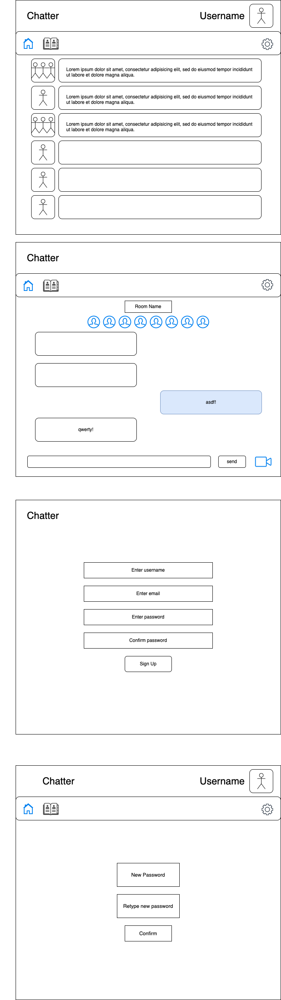
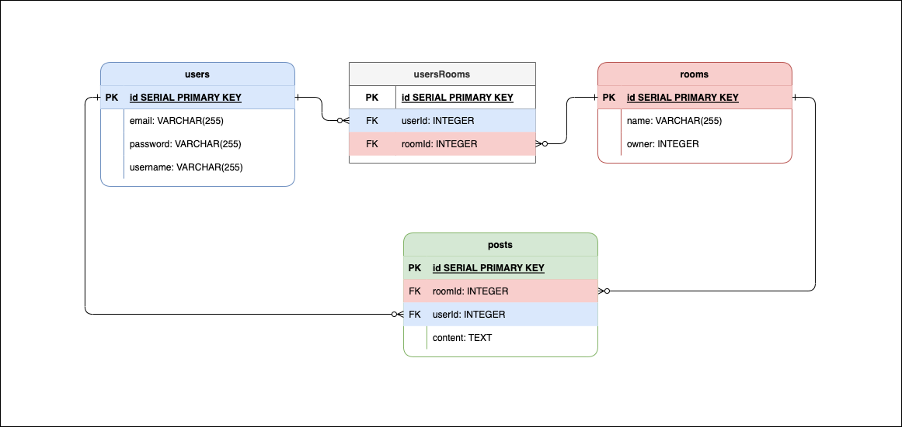

# Chatter
first socket.io implementation

# Project Idea and Description

# Link to Current Version

# Product Screenshots

# Technologies Used

# Installation Instructions

## Client

## Server

# RESTful Routing Chart (Express Server API)

# Client URL Patterns (React Routes)

# Wireframes

 Click to display

# ERD

# User Stories

# MVP Goals

# Stretch Goals

# Resources